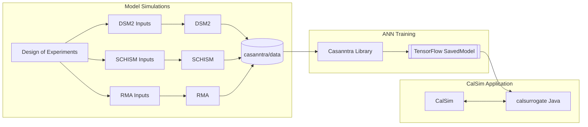

# Casanntra: Transfer Learning for Multi-Fidelity Surrogate Modeling of Delta Salinity

[](https://www.python.org/downloads/)
[](https://www.tensorflow.org/)
[](LICENSE)

**Casanntra** is a TensorFlow/Keras library for training surrogate neural networks that emulate hydrodynamic models of the Sacramento-San Joaquin Delta. The framework implements **staged transfer learning** to bridge the gap between computationally efficient 1D models (DSM2) and high-fidelity 3D models (SCHISM), enabling rapid evaluation of salinity under drought and climate change scenarios.

---

## Table of Contents

1. [Motivation](#motivation)
2. [Scientific Background](#scientific-background)
3. [System Architecture](#system-architecture)
4. [Neural Network Architectures](#neural-network-architectures)
5. [Transfer Learning Strategies](#transfer-learning-strategies)
6. [MultiStage vs MultiScenario Builders](#multistage-vs-multiscenario-builders)
7. [Hyperparameter Analysis](#hyperparameter-analysis)
8. [Installation](#installation)
9. [Quick Start](#quick-start)
10. [Repository Structure](#repository-structure)
11. [Configuration Reference](#configuration-reference)
12. [Experimental Results](#experimental-results)
13. [Integration with CalSim](#integration-with-calsim)
14. [Citation](#citation)

---

## Motivation

California's Sacramento-San Joaquin Delta serves as a critical hub for freshwater conveyance, supplying water to over 25 million residents and 3 million acres of farmland. During extended drought conditions intensified by climate change, net Delta outflow must counter tidal mixing of ocean salt—a "water cost" that can represent a significant fraction of reservoir storage.

```
┌─────────────────────────────────────────────────────────────────────────────┐
│                    THE DELTA SALINITY CHALLENGE                              │
├─────────────────────────────────────────────────────────────────────────────┤
│                                                                              │
│   PACIFIC        SAN FRANCISCO       SACRAMENTO-SAN JOAQUIN                 │
│    OCEAN             BAY                    DELTA                           │
│                                                                              │
│   ≈≈≈≈≈≈≈≈       ≈≈≈≈≈≈≈≈≈≈≈≈        ══════════════════                    │
│   ≈ SALT ≈  ───► ≈  TIDAL   ≈  ───►  ║   FRESHWATER   ║ ◄─── Sacramento R. │
│   ≈≈≈≈≈≈≈≈       ≈  MIXING  ≈        ║    SUPPLY      ║ ◄─── San Joaquin R.│
│                  ≈≈≈≈≈≈≈≈≈≈≈≈        ══════════════════                    │
│                                              │                               │
│                       X2 ◄───────────────────┘                               │
│                  (2 psu isohaline)                                           │
│                                                                              │
│   During drought: Less outflow → Salt intrudes further → Higher "water cost"│
└─────────────────────────────────────────────────────────────────────────────┘
```

### The Modeling Challenge

| Model | Fidelity | Runtime | Training Data | Limitation |
|-------|----------|---------|---------------|------------|
| **DSM2** | 1D | Minutes | 100+ years | Can't resolve SLR, restoration |
| **SCHISM** | 3D | Days | 5-7 years | Too slow for planning |
| **CalSim** | Optimization | Seconds | Needs surrogate | Monthly timestep |

**Casanntra bridges this gap through transfer learning:**

```
┌──────────────────────────────────────────────────────────────────────────┐
│                    TRANSFER LEARNING SOLUTION                             │
├──────────────────────────────────────────────────────────────────────────┤
│                                                                           │
│  ┌─────────────┐      ┌─────────────┐      ┌─────────────┐               │
│  │   DSM2      │      │   SCHISM    │      │  SCENARIO   │               │
│  │  100 years  │ ───► │   5 years   │ ───► │   5 years   │               │
│  │  Base ANN   │      │  Fine-tune  │      │  Specialize │               │
│  └─────────────┘      └─────────────┘      └─────────────┘               │
│        │                    │                    │                        │
│        │    KNOWLEDGE TRANSFER                   │                        │
│        └────────────────────┴────────────────────┘                        │
│                             │                                             │
│                             ▼                                             │
│                 ┌─────────────────────┐                                   │
│                 │   FAST SURROGATE    │                                   │
│                 │   (milliseconds)    │                                   │
│                 │   for 80-yr CalSim  │                                   │
│                 └─────────────────────┘                                   │
└──────────────────────────────────────────────────────────────────────────┘
```

---

## Scientific Background

### The Delta Salinity Problem

Salt intrusion in the Delta is governed by the balance between freshwater outflow and tidal mixing from San Francisco Bay. The primary indicator is **X2**—the distance in kilometers from the Golden Gate to the 2 psu (practical salinity unit) isohaline.

### Antecedent Dependence

The relationship between outflow and salinity exhibits strong **memory effects**: today's salinity reflects the integrated history of flows over 60-120 days.

```
┌─────────────────────────────────────────────────────────────────────────────┐
│                    ANTECEDENT FLOW DEPENDENCE                                │
├─────────────────────────────────────────────────────────────────────────────┤
│                                                                              │
│  Flow History (90-120 days lookback)              Today's Salinity           │
│  ════════════════════════════════════             ═══════════════           │
│                                                                              │
│  Day -90  ──┐                                                                │
│  Day -89  ──┤                                                                │
│  Day -88  ──┤     ┌─────────────────────┐                                   │
│     ...     ├────►│  RECURRENT NEURAL   │────►  EC(t) at 19 stations        │
│  Day -2   ──┤     │     NETWORK         │                                   │
│  Day -1   ──┤     │  (GRU/LSTM layers)  │────►  X2(t) position              │
│  Day  0   ──┘     └─────────────────────┘                                   │
│                                                                              │
│  Each input: [northern_flow, exports, sjr_flow, cu_delta,                   │
│               sf_tidal_energy, sf_tidal_filter, dcc, smscg]                 │
│                                                                              │
└─────────────────────────────────────────────────────────────────────────────┘
```

### The G-Model Concept

Traditional surrogate modeling employs "G-models" that express salinity as a function of antecedent outflow:

```
EC(t) = f(Q(t), Q(t-1), ..., Q(t-n), Tidal(t), Gates(t))
```

Casanntra extends this by:
1. Learning antecedent weighting implicitly through recurrent layers
2. Incorporating 8 input features with domain-specific preprocessing
3. Capturing nonlinear interactions through deep learning

### D-1641 Compliance Framework

California State Water Resources Control Board Decision 1641 (D-1641) establishes water quality standards for the Delta. Key compliance metrics include:

```
┌─────────────────────────────────────────────────────────────────────────────┐
│                    D-1641 COMPLIANCE FRAMEWORK                               │
├─────────────────────────────────────────────────────────────────────────────┤
│                                                                              │
│  WATER QUALITY STANDARDS                                                     │
│  ═══════════════════════                                                     │
│  • Maximum EC (electrical conductivity) at compliance stations              │
│  • X2 position requirements (km from Golden Gate)                           │
│  • Seasonal variations (wet year vs dry year standards)                     │
│                                                                              │
│  COMPLIANCE STATIONS (selected)                                              │
│  ═════════════════════════════                                               │
│  ┌──────────┬────────────────────────────────────────────────┐              │
│  │ Station  │ Description                                     │              │
│  ├──────────┼────────────────────────────────────────────────┤              │
│  │ mrz      │ Martinez - downstream, near bay                 │              │
│  │ pct      │ Port Chicago - tidal influence zone             │              │
│  │ mal      │ Mallard Island - key salinity indicator         │              │
│  │ emm2     │ Emmaton - Sacramento River compliance           │              │
│  │ jer      │ Jersey Point - San Joaquin compliance           │              │
│  │ x2       │ X2 position - 2 psu isohaline location          │              │
│  └──────────┴────────────────────────────────────────────────┘              │
│                                                                              │
│  WHY THIS MATTERS FOR MODELING                                               │
│  ═════════════════════════════                                               │
│  CalSim operations model must predict whether proposed operations will      │
│  maintain D-1641 compliance. Accurate salinity surrogates enable:           │
│  • Rapid evaluation of 80+ year planning scenarios                          │
│  • Optimization of reservoir releases to minimize "water cost"              │
│  • Assessment of climate change impacts on compliance                        │
│                                                                              │
└─────────────────────────────────────────────────────────────────────────────┘
```

### Water Cost Concept

**Water cost** is the freshwater volume required to maintain salinity standards at compliance locations. During drought, this represents a significant fraction of reservoir storage.

```
┌─────────────────────────────────────────────────────────────────────────────┐
│                         WATER COST CONCEPT                                   │
├─────────────────────────────────────────────────────────────────────────────┤
│                                                                              │
│  DEFINITION                                                                  │
│  ══════════                                                                  │
│  Water Cost = Volume of freshwater outflow needed to push X2                │
│               downstream to meet compliance standards                        │
│                                                                              │
│  DROUGHT IMPACT                                                              │
│  ══════════════                                                              │
│                                                                              │
│  Normal Year:                      Drought Year:                            │
│  ────────────                      ─────────────                            │
│  High inflow → Low water cost      Low inflow → High water cost             │
│                                                                              │
│  Reservoir            X2          Reservoir            X2                   │
│  ┌────────┐     ←┈┈┈┈┈│          ┌────────┐     ←┈┈┈┈┈┈┈┈┈│                │
│  │████████│          ◄│          │████    │              │►               │
│  │████████│           │          │████    │              │  Salt intrusion│
│  └────────┘           │          └────────┘              │                │
│   Plenty of      Close to        Limited         Further inland           │
│   storage        Golden Gate     storage         (more outflow needed)     │
│                                                                              │
│  SCENARIO EVALUATION                                                         │
│  ═══════════════════                                                         │
│  Casanntra enables comparison of water cost across scenarios:               │
│  • Sea level rise: How much MORE outflow needed with +1ft, +2.7ft SLR?     │
│  • Restoration: Can habitat restoration REDUCE water cost?                  │
│  • Barriers: Do temporary barriers help during critical periods?            │
│                                                                              │
└─────────────────────────────────────────────────────────────────────────────┘
```

### Round-Trip Validation

A critical validation step ensures ANN surrogates perform correctly when embedded in CalSim:

```
┌─────────────────────────────────────────────────────────────────────────────┐
│                       ROUND-TRIP VALIDATION                                  │
├─────────────────────────────────────────────────────────────────────────────┤
│                                                                              │
│  VALIDATION LOOP                                                             │
│  ═══════════════                                                             │
│                                                                              │
│  ┌──────────────┐    ┌──────────────┐    ┌──────────────┐                   │
│  │   CalSim     │    │  Surrogate   │    │  Multi-D     │                   │
│  │ (80-yr run)  │───►│    ANN       │    │   Model      │                   │
│  │              │    │ (casanntra)  │    │ (SCHISM/RMA) │                   │
│  └──────────────┘    └──────────────┘    └──────────────┘                   │
│         │                   │                   │                            │
│         │                   ▼                   │                            │
│         │         ┌──────────────┐              │                            │
│         │         │  Predicted   │              │                            │
│         └────────►│   Salinity   │◄─────────────┘                            │
│       Inputs:     │  (daily EC)  │    Validation:                           │
│       flows,      └──────────────┘    Re-run same                           │
│       exports,           │            hydrology in                          │
│       gates              │            full physics                          │
│                          ▼            model                                  │
│                  ┌──────────────┐                                           │
│                  │   COMPARE    │                                           │
│                  │  ANN vs 3D   │                                           │
│                  │   outputs    │                                           │
│                  └──────────────┘                                           │
│                                                                              │
│  PURPOSE                                                                     │
│  ═══════                                                                     │
│  1. Verify ANN generalizes beyond training data                             │
│  2. Confirm CalSim operations produce intended salinity outcomes            │
│  3. Quantify uncertainty in planning scenarios                               │
│  4. Build confidence for regulatory acceptance                               │
│                                                                              │
└─────────────────────────────────────────────────────────────────────────────┘
```

### Scenario Library

Current scenarios implemented in casanntra:

| Scenario ID | Description | Model Source | Status |
|-------------|-------------|--------------|--------|
| `base` | Contemporary Delta (current bathymetry, no SLR) | DSM2, SCHISM | ✓ Complete |
| `suisun` | Suisun Marsh restoration (tidal wetlands) | SCHISM | ✓ Complete |
| `slr` | Sea level rise (+1ft, +2.7ft scenarios) | SCHISM | ✓ Complete |
| `cache` | Cache Slough restoration complex | SCHISM | ✓ Complete |
| `franks` | Franks Tract Futures (habitat restoration) | SCHISM, RMA | ✓ Complete |

**Planned/Future Scenarios:**
- Temporary barriers (West False River)
- Combined scenarios (SLR + restoration)
- Catastrophic drought extensions
- Climate-adjusted hydrology

---

## System Architecture

### End-to-End Workflow



### Data Flow Pipeline

```
┌─────────────────────────────────────────────────────────────────────────────┐
│                         DATA FLOW PIPELINE                                   │
├─────────────────────────────────────────────────────────────────────────────┤
│                                                                              │
│  ┌──────────────┐     ┌──────────────┐     ┌──────────────┐                 │
│  │  CSV Files   │     │  read_data() │     │   Lagged     │                 │
│  │  (datetime,  │ ──► │  Glob match  │ ──► │   Features   │                 │
│  │   case,      │     │  + validate  │     │  (90 days)   │                 │
│  │   features)  │     └──────────────┘     └──────────────┘                 │
│  └──────────────┘                                 │                          │
│                                                   ▼                          │
│  ┌──────────────┐     ┌──────────────┐     ┌──────────────┐                 │
│  │  Trained     │     │  fit_model() │     │  K-Fold CV   │                 │
│  │   Model      │ ◄── │  Two-phase   │ ◄── │  Time-based  │                 │
│  │  (.h5 file)  │     │  training    │     │  splits      │                 │
│  └──────────────┘     └──────────────┘     └──────────────┘                 │
│        │                                                                     │
│        ▼                                                                     │
│  ┌──────────────────────────────────────────────────────────────────────┐   │
│  │  Output: {prefix}_xvalid_*.csv (cross-validated predictions)         │   │
│  │          {prefix}.h5 + .weights.h5 (trained model)                   │   │
│  └──────────────────────────────────────────────────────────────────────┘   │
└─────────────────────────────────────────────────────────────────────────────┘
```

---

## Neural Network Architectures

### GRU vs LSTM Comparison

Casanntra supports both GRU (Gated Recurrent Unit) and LSTM (Long Short-Term Memory) architectures. **GRU is the default** due to faster training with comparable performance.

```
┌─────────────────────────────────────────────────────────────────────────────┐
│                    GRU vs LSTM ARCHITECTURE COMPARISON                       │
├─────────────────────────────────────────────────────────────────────────────┤
│                                                                              │
│  LSTM (Long Short-Term Memory)          GRU (Gated Recurrent Unit)          │
│  ══════════════════════════════          ══════════════════════════          │
│                                                                              │
│  ┌─────────────────────────┐            ┌─────────────────────────┐         │
│  │  3 Gates:               │            │  2 Gates:               │         │
│  │  • Forget gate (f)      │            │  • Reset gate (r)       │         │
│  │  • Input gate (i)       │            │  • Update gate (z)      │         │
│  │  • Output gate (o)      │            │                         │         │
│  │                         │            │  Fewer parameters       │         │
│  │  Separate cell state    │            │  No separate cell state │         │
│  │  and hidden state       │            │                         │         │
│  └─────────────────────────┘            └─────────────────────────┘         │
│                                                                              │
│  Parameters (32 units):                 Parameters (32 units):               │
│  4 × (32×32 + 32×8 + 32) = 5,248        3 × (32×32 + 32×8 + 32) = 3,936     │
│                                                                              │
│  ┌─────────────────────────────────────────────────────────────────────┐    │
│  │  RECOMMENDATION: Use GRU (default)                                   │    │
│  │  • 25% fewer parameters → faster training                            │    │
│  │  • Similar performance on Delta salinity task                        │    │
│  │  • Better gradient flow for 90-120 day sequences                     │    │
│  └─────────────────────────────────────────────────────────────────────┘    │
└─────────────────────────────────────────────────────────────────────────────┘
```

### Base Neural Network Architecture

```
┌─────────────────────────────────────────────────────────────────────────────┐
│                    BASE NEURAL NETWORK ARCHITECTURE                          │
├─────────────────────────────────────────────────────────────────────────────┤
│                                                                              │
│  INPUT LAYER (8 features × 90-120 days)                                      │
│  ═══════════════════════════════════════                                     │
│                                                                              │
│  ┌────────────┐ ┌────────────┐ ┌────────────┐ ┌────────────┐                │
│  │ northern   │ │  exports   │ │  sjr_flow  │ │  cu_delta  │                │
│  │ _flow(105) │ │   (105)    │ │   (105)    │ │   (105)    │                │
│  └─────┬──────┘ └─────┬──────┘ └─────┬──────┘ └─────┬──────┘                │
│        │              │              │              │                        │
│        ▼              ▼              ▼              ▼                        │
│  ┌────────────┐ ┌────────────┐ ┌────────────┐ ┌────────────┐                │
│  │ ModExpDecay│ │ ModExpDecay│ │ ModExpDecay│ │   Norm     │                │
│  │  b=70000   │ │  b=70000   │ │  b=40000   │ │  (μ=0,σ=1) │                │
│  └─────┬──────┘ └─────┬──────┘ └─────┬──────┘ └─────┬──────┘                │
│        │              │              │              │                        │
│  ┌────────────┐ ┌────────────┐ ┌────────────┐ ┌────────────┐                │
│  │ sf_tidal   │ │ sf_tidal   │ │    dcc     │ │   smscg    │                │
│  │ _energy    │ │ _filter    │ │  (gate)    │ │  (gate)    │                │
│  └─────┬──────┘ └─────┬──────┘ └─────┬──────┘ └─────┬──────┘                │
│        │              │              │              │                        │
│        ▼              ▼              ▼              ▼                        │
│  ┌────────────┐ ┌────────────┐ ┌────────────┐ ┌────────────┐                │
│  │   Norm     │ │   Norm     │ │ Rescale(1) │ │ Rescale(1) │                │
│  └─────┬──────┘ └─────┬──────┘ └─────┬──────┘ └─────┬──────┘                │
│        │              │              │              │                        │
│        └──────────────┴──────────────┴──────────────┘                        │
│                              │                                               │
│                              ▼                                               │
│  ┌──────────────────────────────────────────────────────────────────────┐   │
│  │                    STACK → (batch, 105, 8)                            │   │
│  └──────────────────────────────────────────────────────────────────────┘   │
│                              │                                               │
│                              ▼                                               │
│  ┌──────────────────────────────────────────────────────────────────────┐   │
│  │            GRU Layer 1 (lay1): 32 or 38 units                         │   │
│  │            return_sequences=True → (batch, 105, 32)                   │   │
│  │            [Freeze: trainable controlled by schedule]                 │   │
│  └──────────────────────────────────────────────────────────────────────┘   │
│                              │                                               │
│                              ▼                                               │
│  ┌──────────────────────────────────────────────────────────────────────┐   │
│  │            GRU Layer 2 (lay2): 16 or 19 units                         │   │
│  │            return_sequences=False → (batch, 16)                       │   │
│  │            [Time-collapsed feature vector]                            │   │
│  └──────────────────────────────────────────────────────────────────────┘   │
│                              │                                               │
│                              ▼                                               │
│  ┌──────────────────────────────────────────────────────────────────────┐   │
│  │            Dense Head: 19 outputs (scaled)                            │   │
│  │            Activation: ELU                                            │   │
│  └──────────────────────────────────────────────────────────────────────┘   │
│                              │                                               │
│                              ▼                                               │
│  ┌──────────────────────────────────────────────────────────────────────┐   │
│  │            UnscaleLayer: multiply by station scale factors            │   │
│  │            [x2: 100, mrz: 30000, pct: 20000, ...]                     │   │
│  └──────────────────────────────────────────────────────────────────────┘   │
│                              │                                               │
│                              ▼                                               │
│                      19 STATION OUTPUTS                                      │
│           (EC in μmhos/cm, X2 in km, unscaled)                              │
│                                                                              │
└─────────────────────────────────────────────────────────────────────────────┘
```

### Modified Exponential Decay Preprocessing

Rivers fluctuate to high flows (300,000 cfs) but salinity response saturates around 70,000 cfs. The `ModifiedExponentialDecayLayer` compresses high flows:

```
┌─────────────────────────────────────────────────────────────────────────────┐
│                    FLOW PREPROCESSING: ModifiedExponentialDecay              │
├─────────────────────────────────────────────────────────────────────────────┤
│                                                                              │
│  Formula: f(x) = (e^(-ax) - e^(-ab)) / (1 - e^(-ab))                        │
│                                                                              │
│  Parameters:                                                                 │
│  • Sacramento/Northern flow: a=1e-5, b=70,000 cfs                           │
│  • San Joaquin flow: a=1e-5, b=40,000 cfs                                   │
│                                                                              │
│  1.0 ┤                                                                       │
│      │ ╭─────────────────────────────────────  (saturates)                  │
│  0.8 ┤╱                                                                      │
│      │                                                                       │
│  0.6 ┤     Raw flow (linear)                                                │
│      │    ╱                                                                  │
│  0.4 ┤   ╱     vs                                                           │
│      │  ╱                                                                    │
│  0.2 ┤ ╱      Transformed (compressed)                                      │
│      │╱                                                                      │
│  0.0 ┼──────────────────────────────────────────────────────                │
│      0     50k    100k    150k    200k    250k    300k                      │
│                         Flow (cfs)                                           │
│                                                                              │
│  Effect: High flows (>70k cfs) that don't affect salinity are compressed,  │
│          improving gradient flow and model sensitivity to relevant range.   │
└─────────────────────────────────────────────────────────────────────────────┘
```

---

## Transfer Learning Strategies

### DSM2 Pretraining: The Foundation

DSM2 (Delta Simulation Model 2) provides extensive training data spanning 100+ years of historical and synthetic hydrology. This stage establishes the fundamental salinity-flow relationships.

```
┌─────────────────────────────────────────────────────────────────────────────┐
│                         DSM2 PRETRAINING (Stage 1)                           │
├─────────────────────────────────────────────────────────────────────────────┤
│                                                                              │
│  WHY DSM2 FIRST?                                                            │
│  ═══════════════                                                            │
│  • Fast execution (minutes per year)                                        │
│  • Well-calibrated for contemporary Delta                                   │
│  • 100+ years of training data available                                    │
│  • Captures core salinity-flow physics                                      │
│                                                                              │
│  TRAINING DATA SOURCES                                                       │
│  ═════════════════════                                                       │
│  ┌─────────────────────┐     ┌─────────────────────┐                        │
│  │ dsm2_base_          │     │ dsm2_base_          │                        │
│  │ historical.csv      │  +  │ calsim.csv          │                        │
│  │ (1922-2015)         │     │ (synthetic cases)   │                        │
│  └─────────────────────┘     └─────────────────────┘                        │
│                                                                              │
│  WHAT THE MODEL LEARNS                                                       │
│  ═════════════════════                                                       │
│  ✓ Antecedent flow weighting (which past days matter most)                  │
│  ✓ Seasonal patterns (wet vs dry season response)                           │
│  ✓ Gate operation effects (DCC, SMSCG)                                      │
│  ✓ Tidal influence modulation                                               │
│  ✓ Station-specific responses (upstream vs downstream)                      │
│                                                                              │
│  TRAINING CONFIGURATION                                                      │
│  ══════════════════════                                                      │
│  • transfer_type: None (fresh initialization)                               │
│  • Learning rate: 0.008 → 0.001 (two-phase)                                 │
│  • Epochs: 10 (init) + 35-100 (main)                                        │
│  • All layers trainable                                                      │
│  • Output: dsm2_base.h5                                                     │
│                                                                              │
└─────────────────────────────────────────────────────────────────────────────┘
```

### Direct vs Contrastive Transfer Learning

```
┌─────────────────────────────────────────────────────────────────────────────┐
│                    DIRECT vs CONTRASTIVE TRANSFER                            │
├─────────────────────────────────────────────────────────────────────────────┤
│                                                                              │
│  ╔═══════════════════════════════════════════════════════════════════════╗  │
│  ║                        DIRECT TRANSFER                                 ║  │
│  ╠═══════════════════════════════════════════════════════════════════════╣  │
│  ║                                                                        ║  │
│  ║  Classic fine-tuning: continue training on new data                   ║  │
│  ║                                                                        ║  │
│  ║  ┌─────────────┐         ┌─────────────┐         ┌─────────────┐      ║  │
│  ║  │  Pretrained │  Load   │   Resume    │  Save   │   Adapted   │      ║  │
│  ║  │    Model    │ ──────► │  Training   │ ──────► │    Model    │      ║  │
│  ║  │ (DSM2 Base) │         │(SCHISM data)│         │(SCHISM Base)│      ║  │
│  ║  └─────────────┘         └─────────────┘         └─────────────┘      ║  │
│  ║                                                                        ║  │
│  ║  Architecture:                                                         ║  │
│  ║  ┌─────────────────────────────────────────────────────────────────┐  ║  │
│  ║  │  Trunk (GRU layers)  ──►  Single Dense Head  ──►  19 outputs    │  ║  │
│  ║  └─────────────────────────────────────────────────────────────────┘  ║  │
│  ║                                                                        ║  │
│  ║  Loss: L = MAE(predicted, actual)                                     ║  │
│  ║                                                                        ║  │
│  ║  USE WHEN:                                                             ║  │
│  ║  • Abundant target data available                                      ║  │
│  ║  • Source and target domains are similar                               ║  │
│  ║  • Base model skill not critical to preserve                           ║  │
│  ║                                                                        ║  │
│  ╚═══════════════════════════════════════════════════════════════════════╝  │
│                                                                              │
│  ╔═══════════════════════════════════════════════════════════════════════╗  │
│  ║                      CONTRASTIVE TRANSFER                              ║  │
│  ╠═══════════════════════════════════════════════════════════════════════╣  │
│  ║                                                                        ║  │
│  ║  Two-head architecture: learn target, source, AND their difference   ║  │
│  ║                                                                        ║  │
│  ║  Architecture:                                                         ║  │
│  ║  ┌─────────────────────────────────────────────────────────────────┐  ║  │
│  ║  │                      SHARED TRUNK                                │  ║  │
│  ║  │               (GRU layers from prior step)                       │  ║  │
│  ║  └──────────────────────────┬──────────────────────────────────────┘  ║  │
│  ║                             │                                          ║  │
│  ║               ┌─────────────┴─────────────┐                           ║  │
│  ║               │                           │                            ║  │
│  ║               ▼                           ▼                            ║  │
│  ║  ┌─────────────────────┐     ┌─────────────────────┐                  ║  │
│  ║  │    TARGET HEAD      │     │    SOURCE HEAD      │                  ║  │
│  ║  │  (scenario output)  │     │   (base output)     │                  ║  │
│  ║  │   Dense(19, elu)    │     │   Dense(19, elu)    │                  ║  │
│  ║  └──────────┬──────────┘     └──────────┬──────────┘                  ║  │
│  ║             │                           │                              ║  │
│  ║             │      ┌────────────────────┘                              ║  │
│  ║             │      │                                                   ║  │
│  ║             ▼      ▼                                                   ║  │
│  ║        ┌────────────────┐                                              ║  │
│  ║        │   SUBTRACT     │                                              ║  │
│  ║        │ target - source│                                              ║  │
│  ║        │ (contrast head)│                                              ║  │
│  ║        └────────────────┘                                              ║  │
│  ║                                                                        ║  │
│  ║  Loss: L = w_t × MAE(target_pred, target_actual)                      ║  │
│  ║         + w_s × MAE(source_pred, source_actual)                       ║  │
│  ║         + w_c × MAE(contrast_pred, target_actual - source_actual)     ║  │
│  ║                                                                        ║  │
│  ║  USE WHEN:                                                             ║  │
│  ║  • Limited target data (scenarios: 5-7 years)                          ║  │
│  ║  • Need to preserve base model skill                                   ║  │
│  ║  • Scenario delta is smoother than absolute values                     ║  │
│  ║  • Training base + scenario jointly                                    ║  │
│  ║                                                                        ║  │
│  ╚═══════════════════════════════════════════════════════════════════════╝  │
│                                                                              │
└─────────────────────────────────────────────────────────────────────────────┘
```

### The Contrastive Effect

Why does contrastive learning help? The scenario **delta** (difference from base) is often smoother and easier to learn than absolute salinity values.

```
┌─────────────────────────────────────────────────────────────────────────────┐
│                    THE CONTRASTIVE EFFECT                                    │
├─────────────────────────────────────────────────────────────────────────────┤
│                                                                              │
│  ABSOLUTE SALINITY (harder to learn)     SCENARIO DELTA (easier to learn)   │
│  ═══════════════════════════════════     ═══════════════════════════════    │
│                                                                              │
│  EC (μS/cm)                              ΔEC (μS/cm)                         │
│  30000 ┤         ╱╲                      +2000 ┤                             │
│        │        ╱  ╲    ╱╲                     │      ___                    │
│  20000 ┤   ╱╲  ╱    ╲  ╱  ╲                    │   __╱   ╲__                 │
│        │  ╱  ╲╱      ╲╱    ╲                   │  ╱         ╲                │
│  10000 ┤ ╱                  ╲                0 ┼─────────────────            │
│        │╱                    ╲                 │                             │
│      0 ┼──────────────────────────       -500 ┤                             │
│        Jan  Mar  May  Jul  Sep  Nov           Jan  Mar  May  Jul  Sep  Nov  │
│                                                                              │
│  • High dynamic range (0-30,000)         • Low dynamic range (-500 to +2000)│
│  • Sharp transitions                     • Smooth, gradual changes          │
│  • Noise amplified                       • Noise cancelled (common-mode)    │
│                                                                              │
│  ┌─────────────────────────────────────────────────────────────────────┐    │
│  │  BENEFIT: By learning the delta explicitly, the model focuses on    │    │
│  │  what's DIFFERENT about the scenario, not re-learning base physics. │    │
│  │                                                                      │    │
│  │  contrast_weight=0.5 gives best results (emphasize delta learning)  │    │
│  └─────────────────────────────────────────────────────────────────────┘    │
│                                                                              │
└─────────────────────────────────────────────────────────────────────────────┘
```

### Three-Stage Training Pipeline

```
┌─────────────────────────────────────────────────────────────────────────────┐
│                    THREE-STAGE TRANSFER PIPELINE                             │
├─────────────────────────────────────────────────────────────────────────────┤
│                                                                              │
│  STAGE 1: DSM2 BASE              STAGE 2: SCHISM BASE        STAGE 3: SCENARIO
│  ════════════════════            ════════════════════        ═════════════════
│                                                                              │
│  ┌─────────────────┐            ┌─────────────────┐         ┌─────────────────┐
│  │ Random Init     │            │ Load Stage 1    │         │ Load Stage 2    │
│  │                 │            │                 │         │                 │
│  │  ┌───────────┐  │            │  ┌───────────┐  │         │  ┌───────────┐  │
│  │  │  GRU 32   │◄─┼─ train     │  │  GRU 32   │◄─┼─ train  │  │  GRU 32   │◄─┼─ FREEZE
│  │  └───────────┘  │            │  └───────────┘  │         │  └───────────┘  │
│  │  ┌───────────┐  │            │  ┌───────────┐  │         │  ┌───────────┐  │
│  │  │  GRU 16   │◄─┼─ train     │  │  GRU 16   │◄─┼─ train  │  │  GRU 16   │◄─┼─ train
│  │  └───────────┘  │            │  └───────────┘  │         │  └───────────┘  │
│  │  ┌───────────┐  │            │  ┌───────────┐  │         │  ┌───────────┐  │
│  │  │   Head    │◄─┼─ train     │  │   Head    │◄─┼─ train  │  │Target Head│◄─┼─ train
│  │  └───────────┘  │            │  └───────────┘  │         │  ├───────────┤  │
│  │                 │            │                 │         │  │Source Head│◄─┼─ train
│  └─────────────────┘            └─────────────────┘         │  └───────────┘  │
│                                                              └─────────────────┘
│  Input: DSM2 data               Input: SCHISM base          Input: SCHISM scenario
│  (100+ years)                   (5-7 years)                 + SCHISM base aligned
│                                                                              │
│  Transfer: None                 Transfer: Direct            Transfer: Contrastive
│  LR: 0.008 → 0.001              LR: 0.003 → 0.001           LR: 0.001 → 0.0005
│  Epochs: 10 + 35                Epochs: 10 + 35             Epochs: 10 + 35
│  Freeze: [0]                    Freeze: [0]                 Freeze: [1] ◄── KEY!
│                                                                              │
│  Output: dsm2_base.h5           Output: schism_base.h5      Output: base.suisun.h5
│                                                                              │
└─────────────────────────────────────────────────────────────────────────────┘
```

---

## MultiStage vs MultiScenario Builders

Casanntra provides two model builders for different use cases:

```
┌─────────────────────────────────────────────────────────────────────────────┐
│              MULTISTAGE vs MULTISCENARIO ARCHITECTURE COMPARISON             │
├─────────────────────────────────────────────────────────────────────────────┤
│                                                                              │
│  ╔═══════════════════════════════════════════════════════════════════════╗  │
│  ║                    MultiStageModelBuilder                              ║  │
│  ╠═══════════════════════════════════════════════════════════════════════╣  │
│  ║                                                                        ║  │
│  ║  Purpose: Sequential staged transfer (one scenario at a time)         ║  │
│  ║                                                                        ║  │
│  ║  Pipeline: DSM2 ──► SCHISM ──► Suisun                                 ║  │
│  ║            DSM2 ──► SCHISM ──► SLR       (separate runs)              ║  │
│  ║            DSM2 ──► SCHISM ──► Cache                                  ║  │
│  ║                                                                        ║  │
│  ║  Architecture (contrastive mode):                                     ║  │
│  ║  ┌─────────────────────────────────────────────────────────────────┐  ║  │
│  ║  │                      TRUNK (frozen)                              │  ║  │
│  ║  │               GRU(32) → GRU(16)                                  │  ║  │
│  ║  └─────────────────────────┬───────────────────────────────────────┘  ║  │
│  ║                            │                                          ║  │
│  ║              ┌─────────────┴─────────────┐                           ║  │
│  ║              ▼                           ▼                            ║  │
│  ║     ┌──────────────┐           ┌──────────────┐                      ║  │
│  ║     │ target_head  │           │ source_head  │                      ║  │
│  ║     │  (scenario)  │           │   (base)     │                      ║  │
│  ║     └──────┬───────┘           └──────┬───────┘                      ║  │
│  ║            │                          │                               ║  │
│  ║            └──────────┬───────────────┘                               ║  │
│  ║                       ▼                                               ║  │
│  ║              ┌──────────────┐                                         ║  │
│  ║              │   contrast   │                                         ║  │
│  ║              └──────────────┘                                         ║  │
│  ║                                                                        ║  │
│  ║  Outputs: 2 heads + 1 contrast = 3 total                              ║  │
│  ║  Config key: feature_layers                                           ║  │
│  ║                                                                        ║  │
│  ╚═══════════════════════════════════════════════════════════════════════╝  │
│                                                                              │
│  ╔═══════════════════════════════════════════════════════════════════════╗  │
│  ║                   MultiScenarioModelBuilder                            ║  │
│  ╠═══════════════════════════════════════════════════════════════════════╣  │
│  ║                                                                        ║  │
│  ║  Purpose: Joint multi-task learning (all scenarios simultaneously)   ║  │
│  ║                                                                        ║  │
│  ║  Pipeline: DSM2 ──► SCHISM ──► [Base + Suisun + SLR + Cache + ...]   ║  │
│  ║                                 (single model, shared trunk)          ║  │
│  ║                                                                        ║  │
│  ║  Architecture (contrastive mode):                                     ║  │
│  ║  ┌─────────────────────────────────────────────────────────────────┐  ║  │
│  ║  │                      TRUNK (frozen)                              │  ║  │
│  ║  │               GRU(32) → GRU(16)                                  │  ║  │
│  ║  └────────────────────────┬────────────────────────────────────────┘  ║  │
│  ║                           │                                           ║  │
│  ║      ┌────────────────────┼────────────────────┐                     ║  │
│  ║      │                    │                    │                      ║  │
│  ║      ▼                    ▼                    ▼                      ║  │
│  ║  ┌────────┐          ┌────────┐          ┌────────┐                  ║  │
│  ║  │  base  │          │ suisun │          │  slr   │  ... N heads    ║  │
│  ║  │  head  │          │  head  │          │  head  │                  ║  │
│  ║  └───┬────┘          └───┬────┘          └───┬────┘                  ║  │
│  ║      │                   │                   │                        ║  │
│  ║      │    ┌──────────────┴───────────────────┘                       ║  │
│  ║      │    │              │                                            ║  │
│  ║      │    ▼              ▼                                            ║  │
│  ║      │ ┌────────┐   ┌────────┐                                       ║  │
│  ║      │ │contrast│   │contrast│  ... N contrasts                      ║  │
│  ║      │ │ suisun │   │  slr   │                                       ║  │
│  ║      │ └────────┘   └────────┘                                       ║  │
│  ║      ▼                                                                ║  │
│  ║  out_base  out_suisun  out_slr  contrast_suisun  contrast_slr        ║  │
│  ║                                                                        ║  │
│  ║  Outputs: (N+1) heads + N contrasts = 2N+1 total                      ║  │
│  ║  Config key: trunk_layers, scenarios                                  ║  │
│  ║                                                                        ║  │
│  ║  PARITY: With 1 scenario, produces identical results to MultiStage   ║  │
│  ║                                                                        ║  │
│  ╚═══════════════════════════════════════════════════════════════════════╝  │
│                                                                              │
│  ┌─────────────────────────────────────────────────────────────────────┐    │
│  │  WHEN TO USE EACH:                                                   │    │
│  │                                                                      │    │
│  │  MultiStage:                    MultiScenario:                       │    │
│  │  • Single scenario focus        • Multiple scenarios together        │    │
│  │  • Sequential experiments       • Joint optimization                 │    │
│  │  • Debugging/development        • Production multi-scenario model    │    │
│  │  • Simpler configuration        • Efficient shared trunk             │    │
│  └─────────────────────────────────────────────────────────────────────┘    │
│                                                                              │
└─────────────────────────────────────────────────────────────────────────────┘
```

---

## Hyperparameter Analysis

### Grid Search Space

```
┌─────────────────────────────────────────────────────────────────────────────┐
│                    HYPERPARAMETER SEARCH SPACE                               │
├─────────────────────────────────────────────────────────────────────────────┤
│                                                                              │
│  HYPERPARAM_SPACE = {                                                        │
│      "feature_layers": [                                                     │
│          [GRU(32) → GRU(16)],     # Smaller, faster                         │
│          [GRU(38) → GRU(19)]      # Larger, more capacity                   │
│      ],                                                                      │
│      "freeze_schedule": [                                                    │
│          [0, 0, 0],               # All trainable                           │
│          [0, 0, 1],               # Freeze lay1 in Stage 3                  │
│          [0, 0, 2]                # Freeze both in Stage 3                  │
│      ],                                                                      │
│      "ndays": [90, 105, 120],     # Lookback window                         │
│      "contrast_weight": [0.5, 1.0] # Delta emphasis                         │
│  }                                                                           │
│                                                                              │
│  Total combinations: 2 × 3 × 3 × 2 = 36 trials                              │
│                                                                              │
└─────────────────────────────────────────────────────────────────────────────┘
```

### v4.1 Experimental Results

```
┌─────────────────────────────────────────────────────────────────────────────┐
│                    HYPERPARAMETER SENSITIVITY (v4.1 Results)                 │
├─────────────────────────────────────────────────────────────────────────────┤
│                                                                              │
│  ARCHITECTURE EFFECT                    FREEZE SCHEDULE EFFECT               │
│  ═══════════════════                    ═══════════════════════              │
│                                                                              │
│  NSE                                    NSE                                  │
│  0.942 ┤                                0.942 ┤                              │
│        │           ████                       │      ████                    │
│  0.940 ┤           ████                 0.940 ┤      ████                    │
│        │           ████                       │      ████                    │
│  0.938 ┤           ████                 0.938 ┤████  ████  ████              │
│        │   ████    ████                       │████  ████  ████              │
│  0.936 ┤   ████    ████                 0.936 ┤████  ████  ████              │
│        │   ████    ████                       │████  ████  ████              │
│  0.934 ┤   ████    ████                 0.934 ┤████  ████  ████              │
│        └───────────────────             ──────┴─────────────────             │
│           32→16   38→19                      [0,0,0] [0,0,1] [0,0,2]         │
│                                                                              │
│  Winner: 38→19 (+0.5% NSE)              Winner: [0,0,1] (freeze lay1)        │
│                                                                              │
│  ─────────────────────────────────────────────────────────────────────────  │
│                                                                              │
│  NDAYS EFFECT                           CONTRAST WEIGHT EFFECT               │
│  ════════════                           ══════════════════════               │
│                                                                              │
│  NSE                                    NSE                                  │
│  0.942 ┤                                0.942 ┤                              │
│        │      ████                            │████                          │
│  0.940 ┤      ████                      0.940 ┤████                          │
│        │      ████  ████                      │████  ████                    │
│  0.938 ┤████  ████  ████                0.938 ┤████  ████                    │
│        │████  ████  ████                      │████  ████                    │
│  0.936 ┤████  ████  ████                0.936 ┤████  ████                    │
│        │████  ████  ████                      │████  ████                    │
│  0.934 ┤████  ████  ████                0.934 ┤████  ████                    │
│        └─────────────────────           ──────┴─────────────                 │
│           90    105   120                      0.5    1.0                    │
│                                                                              │
│  Winner: 105 days                       Winner: 0.5 (lower is better)        │
│                                                                              │
└─────────────────────────────────────────────────────────────────────────────┘
```

### Best Configuration Summary

```
┌─────────────────────────────────────────────────────────────────────────────┐
│                    BEST HYPERPARAMETER CONFIGURATION                         │
├─────────────────────────────────────────────────────────────────────────────┤
│                                                                              │
│  ┌─────────────────────────────────────────────────────────────────────┐    │
│  │  OPTIMAL SETTINGS (v4.1 Experiments)                                 │    │
│  ├─────────────────────────────────────────────────────────────────────┤    │
│  │                                                                      │    │
│  │  Architecture:      GRU(38) → GRU(19)                               │    │
│  │  Freeze schedule:   [0, 0, 1]  (freeze lay1 in Stage 3)             │    │
│  │  Lookback (ndays):  105 days                                         │    │
│  │  Contrast weight:   0.5                                              │    │
│  │                                                                      │    │
│  │  Learning rates:                                                     │    │
│  │    Stage 1 (DSM2):    0.008 → 0.001                                 │    │
│  │    Stage 2 (SCHISM):  0.003 → 0.001                                 │    │
│  │    Stage 3 (Scenario): 0.001 → 0.0005                               │    │
│  │                                                                      │    │
│  │  Epochs per stage:   10 (init) + 35 (main)                          │    │
│  │                                                                      │    │
│  └─────────────────────────────────────────────────────────────────────┘    │
│                                                                              │
│  PERFORMANCE COMPARISON                                                      │
│  ══════════════════════                                                      │
│                                                                              │
│  │ Workflow   │ Best Trial │ Mean NSE │ NSE Base │ NSE Target │            │
│  ├────────────┼────────────┼──────────┼──────────┼────────────┤            │
│  │ MSTAGE     │ Trial14    │  0.9402  │  0.9626  │   0.9177   │            │
│  │ MSCEN      │ Trial11    │  0.9363  │  0.9611  │   0.9116   │            │
│  └────────────┴────────────┴──────────┴──────────┴────────────┘            │
│                                                                              │
│  Note: Both workflows use identical hyperparameters with single scenario    │
│        (suisun). Small differences (~0.4%) due to implementation details.   │
│                                                                              │
└─────────────────────────────────────────────────────────────────────────────┘
```

---

## Installation

### Using pip

```bash
git clone https://github.com/CADWRDeltaModeling/casanntra.git
cd casanntra
pip install -e .
```

### Using conda

```bash
git clone https://github.com/CADWRDeltaModeling/casanntra.git
cd casanntra
conda env create -f environment.yml
conda activate casanntra
```

### Dependencies

- Python 3.10+
- TensorFlow 2.x (tested with 2.15-2.20)
- pandas, numpy, scikit-learn
- PyYAML, matplotlib

### Verify Installation

```bash
pytest tests/
python -c "from casanntra.staged_learning import process_config; print('OK')"
```

---

## Quick Start

### 1. Prepare Data

```
data/
├── dsm2_base_historical.csv     # Columns: datetime, case, inputs..., outputs...
├── dsm2_base_calsim.csv
├── schism_base_2021.csv
├── schism_suisun_2021.csv
└── ...
```

### 2. Configure Training

```yaml
# transfer_config.yml
output_dir: "./output"

model_builder_config:
  builder_name: MultiStageModelBuilder
  args:
    input_names: [northern_flow, exports, sjr_flow, cu_delta,
                  sf_tidal_energy, sf_tidal_filter, dcc, smscg]
    output_names:
      x2: 100.0
      mrz: 30000.0
      pct: 20000.0
    ndays: 105

steps:
  - name: dsm2_base
    input_prefix: dsm2_base
    save_model_fname: "{output_dir}/dsm2_base"
    builder_args:
      transfer_type: direct
      feature_layers:
        - {type: GRU, units: 38, name: lay1, return_sequences: true}
        - {type: GRU, units: 19, name: lay2, return_sequences: false}

  - name: dsm2.schism
    input_prefix: schism_base
    load_model_fname: "{output_dir}/dsm2_base"
    save_model_fname: "{output_dir}/schism_base"
    builder_args:
      transfer_type: direct

  - name: base.suisun
    input_prefix: schism_suisun
    load_model_fname: "{output_dir}/schism_base"
    save_model_fname: "{output_dir}/base_suisun"
    builder_args:
      transfer_type: contrastive
      source_data_prefix: schism_base
      contrast_weight: 0.5
      feature_layers:
        - {type: GRU, units: 38, name: lay1, return_sequences: true, trainable: false}
        - {type: GRU, units: 19, name: lay2, return_sequences: false, trainable: true}
```

### 3. Run Training

```python
from casanntra.staged_learning import process_config

process_config("transfer_config.yml",
               ["dsm2_base", "dsm2.schism", "base.suisun"])
```

### 4. Evaluate Results

```python
import pandas as pd
import numpy as np

# Load cross-validation results
df_ref = pd.read_csv("output/base_suisun_xvalid_ref_out_unscaled.csv")
df_pred = pd.read_csv("output/base_suisun_xvalid_0.csv")

# Compute NSE per station
for station in ["x2", "mrz", "pct"]:
    obs = df_ref[station].values
    pred = df_pred[station].values
    nse = 1 - np.sum((obs - pred)**2) / np.sum((obs - np.mean(obs))**2)
    print(f"{station}: NSE = {nse:.4f}")
```

---

## Repository Structure

```
┌─────────────────────────────────────────────────────────────────────────────┐
│                         REPOSITORY STRUCTURE                                 │
├─────────────────────────────────────────────────────────────────────────────┤
│                                                                              │
│  casanntra/                                                                  │
│  ├── casanntra/                    # CORE LIBRARY                           │
│  │   ├── __init__.py                                                        │
│  │   ├── model_builder.py          # Base classes, GRUBuilder2, losses     │
│  │   │   ├── class ModelBuilder         # Abstract base                    │
│  │   │   ├── class GRUBuilder2           # Standard GRU implementation     │
│  │   │   ├── class ScaledMaskedMAE       # NaN-aware loss function         │
│  │   │   ├── class UnscaleLayer          # Output denormalization          │
│  │   │   └── def create_antecedent_inputs()  # Lag feature creation       │
│  │   │                                                                      │
│  │   ├── multi_stage_model_builder.py   # 2-head contrastive transfer      │
│  │   │   └── class MultiStageModelBuilder(GRUBuilder2)                     │
│  │   │       ├── transfer_type: direct | contrastive                       │
│  │   │       ├── def build_model()      # Dual-head architecture          │
│  │   │       └── def pool_and_align_cases()  # Data alignment             │
│  │   │                                                                      │
│  │   ├── multi_scenario_model_builder.py  # N-scenario multi-task         │
│  │   │   └── class MultiScenarioModelBuilder(ModelBuilder)                 │
│  │   │       ├── scenarios: [{id, input_prefix}, ...]                      │
│  │   │       ├── trunk_layers, branch_layers                               │
│  │   │       └── def _build_head_plan()  # Generate N heads + contrasts   │
│  │   │                                                                      │
│  │   ├── staged_learning.py        # YAML orchestration                    │
│  │   │   ├── def process_config()       # Main entry point                │
│  │   │   ├── def fit_from_config()      # Per-step training               │
│  │   │   └── def model_builder_from_config()  # Factory pattern           │
│  │   │                                                                      │
│  │   ├── xvalid_multi.py           # K-fold cross-validation               │
│  │   │   ├── def xvalid_fit_multi()     # Parallel fold execution         │
│  │   │   ├── def single_model_fit()     # Single fold training            │
│  │   │   └── def bulk_fit()             # Final model (no CV)             │
│  │   │                                                                      │
│  │   ├── read_data.py              # CSV loading and validation            │
│  │   │   └── def read_data()            # Glob-based file loading         │
│  │   │                                                                      │
│  │   └── scaling.py                # Feature preprocessing                 │
│  │       └── class ModifiedExponentialDecayLayer                           │
│  │                                                                          │
│  ├── example/                      # TRAINING SCRIPTS & RESULTS            │
│  │   ├── gridsearch_multistage.py      # MSTAGE hyperparameter search     │
│  │   ├── gridsearch_multiscenario.py   # MSCEN hyperparameter search      │
│  │   ├── transfer_config_multistage.yml                                    │
│  │   ├── transfer_config_multiscenario.yml                                 │
│  │   ├── hyperparam_analysis_utils.py  # Sensitivity analysis             │
│  │   ├── postprocess_compare.py        # Results comparison               │
│  │   ├── debug_multistage.py           # Debugging utilities              │
│  │   ├── debug_multiscenario.py                                            │
│  │   ├── v4.1_MSTAGE_Trial*_results/   # Trial outputs                    │
│  │   ├── MSCEN_v4.1_Trial*_results/                                        │
│  │   └── gridsearch_*_master_results.csv  # Summary metrics               │
│  │                                                                          │
│  ├── data/                         # INPUT DATA (188 subdirectories)       │
│  │   ├── dsm2_base_*.csv                                                   │
│  │   ├── schism_base_*.csv                                                 │
│  │   └── schism_{scenario}_*.csv                                           │
│  │                                                                          │
│  ├── tests/                        # UNIT TESTS                            │
│  │   ├── test_antecedent_inputs.py                                         │
│  │   └── test_chronological_antecedent_input.py                            │
│  │                                                                          │
│  ├── paper/                        # MANUSCRIPT DEVELOPMENT                │
│  │   ├── outline.md                                                        │
│  │   └── reference_manual.md                                               │
│  │                                                                          │
│  ├── README.md                     # This file                             │
│  ├── CLAUDE.md                     # AI assistant guidelines               │
│  ├── pyproject.toml                # Package configuration                 │
│  ├── environment.yml               # Conda environment                     │
│  └── LICENSE                       # MIT License                           │
│                                                                              │
└─────────────────────────────────────────────────────────────────────────────┘
```

---

## Configuration Reference

### Model Builder Options

| Parameter | Type | Description |
|-----------|------|-------------|
| `builder_name` | string | `GRUBuilder2`, `MultiStageModelBuilder`, `MultiScenarioModelBuilder` |
| `input_names` | list | Feature column names (8 typical) |
| `output_names` | dict | Station → scale factor mapping (19 typical) |
| `ndays` | int | Antecedent lookback window (90-120) |

### Step Options

| Parameter | Type | Description |
|-----------|------|-------------|
| `input_prefix` | string | Glob pattern for input CSVs |
| `load_model_fname` | string | Path to load weights from |
| `save_model_fname` | string | Path to save trained model |
| `transfer_type` | string | `None`, `direct`, or `contrastive` |
| `feature_layers` | list | Layer specs for MultiStage |
| `trunk_layers` | list | Layer specs for MultiScenario |
| `contrast_weight` | float | Weight on contrast loss (0.0-1.0) |
| `source_data_prefix` | string | Base data for contrastive alignment |
| `init_train_rate` | float | Learning rate for initial phase |
| `main_train_rate` | float | Learning rate for main phase |
| `init_epochs` | int | Epochs for initial phase (10 typical) |
| `main_epochs` | int | Epochs for main phase (35 typical) |
| `pool_size` | int | Number of parallel CV workers |
| `target_fold_length` | string | CV fold duration ("180d" typical) |

### Multi-Scenario Options

| Parameter | Type | Description |
|-----------|------|-------------|
| `scenarios` | list | `[{id: "suisun", input_prefix: "schism_suisun"}, ...]` |
| `per_scenario_branch` | bool | Enable per-scenario adapter layers |
| `branch_layers` | list | Branch layer specifications |
| `include_source_branch` | bool | Apply branch to base head too |
| `source_weight` | float | Weight on base head loss |
| `target_weight` | float | Weight on scenario head losses |

---

## Experimental Results

### Performance by Station (v4.1 Best Configuration)

| Station | Description | NSE (Base) | NSE (Suisun) |
|---------|-------------|------------|--------------|
| x2 | X2 Position (km) | 0.963 | 0.932 |
| mrz | Martinez | 0.983 | 0.971 |
| pct | Port Chicago | 0.989 | 0.984 |
| mal | Mallard Island | 0.991 | 0.987 |
| emm2 | Emmaton | 0.921 | 0.965 |
| jer | Jersey Point | 0.944 | 0.973 |
| sal | Sacramento River | 0.871 | 0.903 |
| frk | Franks Tract | 0.893 | 0.921 |

### Transfer Learning Benefit

| Training Approach | Mean NSE | Data Required | Benefit |
|-------------------|----------|---------------|---------|
| SCHISM only (no transfer) | 0.85 | 5 years | Baseline |
| DSM2 → SCHISM (direct) | 0.91 | 100 + 5 years | +6% |
| DSM2 → SCHISM → Scenario (contrastive) | 0.94 | 100 + 5 + 5 years | +9% |

---

## Integration with CalSim

### Export to SavedModel

```bash
python scripts/convert_and_validate.py \
    transfer_config.yml \
    output/base_suisun.h5 \
    data/validation_input.csv
```

### Architecture for Deployment

```
┌─────────────────────────────────────────────────────────────────────────────┐
│                    CALSIM INTEGRATION ARCHITECTURE                           │
├─────────────────────────────────────────────────────────────────────────────┤
│                                                                              │
│  ┌─────────────────┐     ┌─────────────────┐     ┌─────────────────┐        │
│  │   Casanntra     │     │   TensorFlow    │     │  calsurrogate   │        │
│  │   Training      │ ──► │   SavedModel    │ ──► │  Java Library   │        │
│  │   (Python)      │     │   (.pb format)  │     │                 │        │
│  └─────────────────┘     └─────────────────┘     └────────┬────────┘        │
│                                                           │                  │
│                                                           ▼                  │
│                                               ┌─────────────────────┐       │
│                                               │       CalSim        │       │
│                                               │  (80-year planning) │       │
│                                               │   Monthly timestep  │       │
│                                               └─────────────────────┘       │
│                                                                              │
│  Key: UnscaleLayer included in export → outputs in native units             │
│       (EC in μmhos/cm, X2 in km)                                            │
│                                                                              │
└─────────────────────────────────────────────────────────────────────────────┘
```

---

## Citation

```bibtex
@software{casanntra2024,
  title = {Casanntra: Transfer Learning for Multi-Fidelity Surrogate
           Modeling of Delta Salinity},
  author = {{California Department of Water Resources} and
            {Resource Management Associates}},
  year = {2024},
  url = {https://github.com/CADWRDeltaModeling/casanntra},
  note = {Funded by Delta Stewardship Council, Delta Science Program}
}
```

---

## License

MIT License. See [LICENSE](LICENSE) for details.

---

## Acknowledgments

This work was funded by the Delta Stewardship Council through the Delta Science Program. Development was a collaboration between:

- California Department of Water Resources, Delta Modeling Section
- Resource Management Associates, Inc.

## Known Issues and Troubleshooting

### Broken Notebooks

| Notebook | Issue | Resolution |
|----------|-------|------------|
| `compare_mscen_mstage_results.ipynb` | Imports from nonexistent `postprocess/` module | Functions moved to `hyperparam_analysis_utils.py`; notebook needs refactoring |
| `post_process_ms_results.ipynb` | Uses outdated `RUN_ID = "PLOT_TEST"` | Update to `RUN_ID = "v4.1_MSTAGE"` or `"MSCEN_v4.1"` |

### Common Issues

**TensorFlow GPU not detected:**
```bash
# Casanntra disables GPU by default for reproducibility
# To enable GPU, remove these lines from your script:
import os
os.environ["CUDA_VISIBLE_DEVICES"] = "-1"
```

**NaN values in predictions:**
- Check that input data has no missing values in required columns
- Verify scale factors in `output_names` match expected data ranges
- Ensure `ndays` lookback doesn't exceed available history

**Parity mismatch between MSTAGE and MSCEN:**
- Ensure identical hyperparameters (layer sizes, ndays, freeze schedule)
- Check `contrast_weight` matches between configurations
- Verify random seeds are not interfering with comparison

---

## See Also

- [calsurrogate](https://github.com/CADWRDeltaModeling/calsurrogate) - Java library for CalSim integration
- [calsurrogate-test](https://github.com/CADWRDeltaModeling/calsurrogate-test) - CalSim test problem
- [Interoperability Standards](https://github.com/CADWRDeltaModeling/casanntra/wiki) - Wiki documentation

---

## Project Context

This project was funded by the **Delta Stewardship Council** through the Delta Science Program as a pilot project to evaluate transfer learning approaches for multi-fidelity surrogate modeling. The work addresses California's need to evaluate drought mitigation strategies under climate change, where:

- Traditional DSM2 surrogates cannot represent novel scenarios (SLR, restoration)
- High-fidelity SCHISM/RMA models are too slow for planning-horizon optimization
- Transfer learning bridges this gap by leveraging extensive DSM2 training data

The framework enables CalSim operations modeling to incorporate scenario-specific salinity responses, supporting water resource planning decisions that balance urban/agricultural supply, environmental flows, and regulatory compliance.

---

## Contact

For questions about this project:

- **Can Ruso** - canruso@berkeley.edu
- **Eli Ateljevich** - Eli.Ateljevich@water.ca.gov
