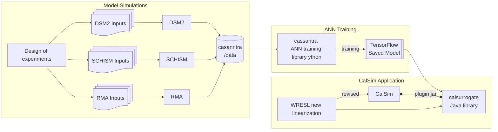

# Casanntra

Casanntra trains neural network surrogates of Bay-Delta hydrodynamic and water quality
models (DSM2, SCHISM, RMA) for use inside CalSim. Training is staged: a model is first fit
to the large DSM2 dataset, then transferred to the smaller SCHISM or RMA datasets, then to
scenario variants of those models (Suisun Marsh, sea level rise, Cache Slough, Franks Tract).
The library and its data were developed by DWR and Resource Management Associates in a
project funded by the Delta Science Program. Trained models are consumed by the
[calsurrogate](https://github.com/CADWRDeltaModeling/calsurrogate) Java library.


```mermaid

%%{init: { "themeVariables": { "fontSize": "24px" } }}%%
flowchart LR
    subgraph Model Simulations 
    doe[Design of experiments] ---> indsm2@{ shape: docs, label: "DSM2 Inputs"}
	doe ---> inschism@{shape: docs, label: "SCHISM Inputs"}
	doe ---> inrma@{shape: docs, label: "RMA Inputs"}
    indsm2 ---> dsm2[DSM2]
    inschism ---> schism[SCHISM]
    inrma ---> rma[RMA]
	dsm2 ---> cassdata@{shape: cyl, label: "casanntra\n/data"}
	schism --->cassdata
	rma ---> cassdata
    end

    subgraph ANN Training
    cassdata ---> casanntra@{shape: rect, label: "cassantra \nANN training library\Python"}
    casanntra --training--> tf[[TensorFlow 
                     Saved Model]]
    end

    subgraph CalSim Application
    tf --> calsur@{shape: rect, label: "calsurrogate\nJava library"}
    wresl[WRESL new linearization] --revised--> CalSim
    CalSim o--plugin jar--o calsur
    wresl ---> calsur
    end

```

## Terminology

- Model: the process model that produced a data file (DSM2, SCHISM, RMA). During transfer
  learning the previous model is the source and the new one the target.
- Case: one configuration of boundary conditions and operations. Cases implement the design
  of experiments; a given year appears in many cases with different perturbations.
- Scenario: a physical modification of the system (for example Suisun Marsh restoration),
  run with the same inputs as the base case so that the difference isolates the modification.
- Fold: cross-validation unit. Cases are split into folds of roughly 180 days so that no
  case and no lag history spans a fold boundary.

Data conventions and the input and output columns are described in [data/readme.md](data/readme.md).

## Model

Inputs are daily time series (flows, exports, consumptive use, tidal energy, gate
operations) with a 105 day history. Large river flows are compressed with a modified
exponential decay before the network; other inputs are normalized. Two GRU layers feed
one dense head per output station. Outputs are trained in scaled units and unscaled
inside the saved model, so CalSim receives EC in micromhos per centimeter and X2 in
kilometers.

Transfer between models works in three ways, selected per step in the YAML config:

- direct: continue training the previous model on the new data
- contrastive: one trunk, one head per model, plus a head for the difference between them
- multi-scenario: one trunk, one head for the base model and one per scenario, with a
  difference head for each scenario

Freezing lower layers and restarting with a low learning rate are configurable per step.
Each step runs an initial phase and a main phase with their own learning rates and epochs.

## Running experiments

```
conda env create -f environment.yml
conda activate casanntra
pip install -e .
cd example
python gridsearch.py experiments/smoke_test.py
```

The smoke test runs the full pipeline on a tiny network in about five minutes. A real run
is the same command with another spec from `example/experiments/`. A spec names a YAML in
`example/configs/`, the steps to run, and the hyperparameter grid; every combination
becomes one trial. Outputs go to `runs/<VERSION>/`:

```
runs/<VERSION>/
  master.csv         one row per trial with mean NSE per head and the grid values
  provenance.txt     start time, host, git commit and working tree diff
  spec.py            copy of the spec
  Trial1/
    config_<step>.yml
    metrics.csv      NSE, r, MAE, RMSE per station and head
    models/          saved model per step (.h5 and .weights.h5)
    xvalid/          cross-validated predictions and reference outputs
    plots/
```

The driver refuses to overwrite an existing run. Set `START_TRIAL=<n>` to resume one.

## Exporting a model for CalSim

```
python -m casanntra.model_conversion <config.yml> <model.h5> <inputs.csv> <head>
```

This wraps the model with the unscaling layer, writes a TensorFlow SavedModel, and checks
its predictions on the given input file. Interoperability conventions are in the
[wiki](https://github.com/CADWRDeltaModeling/casanntra/wiki).

## Layout

```
casanntra/    library: data reading, cross-validation, model builders, staged training, export
data/         training data, one CSV per model and case
example/      gridsearch driver, configs, experiment specs
tests/
```

## Credits

Developed at the California Department of Water Resources, Delta Modeling Section, with
Resource Management Associates, in a project funded and administered by the Delta Science
Program.

- Eli Ateljevich (DWR): design, core library, cross-validation and staged training
- Lily Tomkovic (DWR): model runs, training data
- Ryan Ripken (RMA): RMA model runs, CalSim integration
- Can Ruso (UC Berkeley): multi-scenario training, transfer learning experiments and analysis, repository refactor

MIT license, copyright 2024 Eli Ateljevich.
